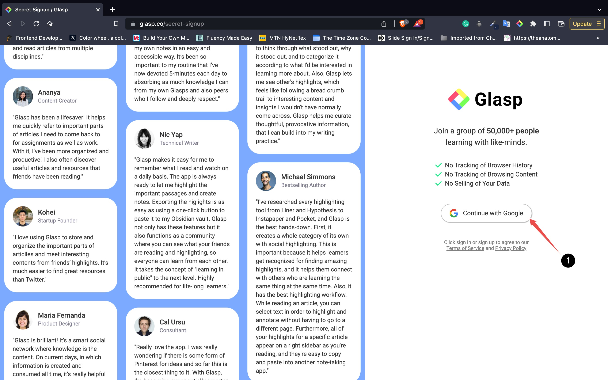
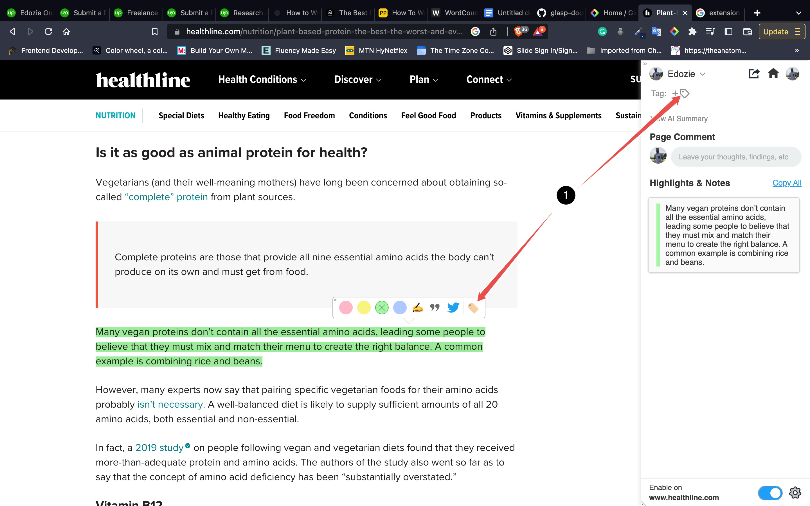
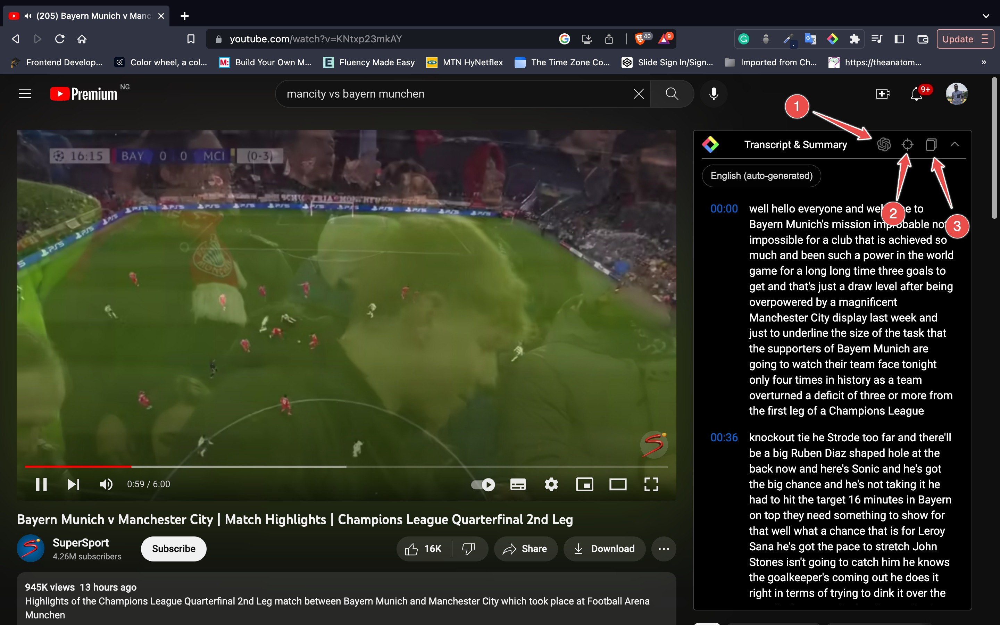

    

#
<h1 align="center">Everything you need to know about Glasp</h1>

## Table of Contents
- [General Information](#general-information)
    - [What is Glasp?](#what-is-glasp)
    - [Availibility](#availibilty)
    - [Company](#company)
- [Features](#features)
- [Installation](#installation)
- [How to use Glasp](#how-to-use-glasp)
- [How to get YouTube transcripts with Glasp](#how-to-get-youtube-transcripts-with-glasp)
- [Contexts in which Glasp can be used](#contexts-in-which-glasp-can-be-used)
- [Additional Information](#additional-information)
    - [Alternatives to Glasp](#alternatives-to-glasp)
    - [FAQ](#faq)
- [Stay In Touch](#stay-in-touch)
- [Resources](#resources)

## General Information

### What is Glasp?
Glasp stands for [Greater Legacy Accumulated as Shared Proof](https://bit.ly/interview-with-glasp-cofounder).

It is a social web highlighter that allows its users to highlight and annotate quotes and ideas on web pages and also share them with others, without having to go back and forth between the web and a note-taking app.

It aims to solve the problem of knowledge inaccessibility where knowledge, insights and experiences are kept in only personal spaces such as note-taking apps, which no one might be able to access. Glasp remedies this issue by providing a free browser extension that lets you quickly capture online content with coloured highlighting options, which are then automatically curated to your Glasp homepage. These highlights can then be tagged, searched for, linked to, and shared on a variety of other platforms, including Twitter, Teams, and Slack.

By enabling collaboration and sharing of knowledge, Glasp aims to create a shared proof of knowledge that can be visualized and accessed by others, especially like-minded people, which would lead to insightful and thought-provoking content to deepen your knowledge and understanding.

### Availibility
Glasp is available on [Chrome Web Store](https://chrome.google.com/webstore/detail/youtube-summary-with-chat/nmmicjeknamkfloonkhhcjmomieiodli) and the [App Store](https://apps.apple.com/ng/app/glasp-social-web-highlighter/id1605690124?mt=12) as a desktop extension. 

It is supported on the following browsers: Chrome, Brave, Safari, Microsoft Edge and Vivaldi. Glasp is a browser extension so it wasn't designed to be used on mobile devices, however, you can access your profile, feed, and export highlights and notes when using a mobile browser.

### Company
Glasp was founded on June 1, 2021 and is currently headquartered in San Francisco, Carlifonia. It currently has a company size of between 2 to 10 employees.

## Features

- Social Web Highlighter: Glasp is a browser extension-based tool that allows users to highlight and capture online content with coloured highlighting options.

- Automatic Curation: The highlights are automatically curated to the user's Glasp homepage for easy access and organization.

- Tagging and Searching: Users can tag their highlights and search for them by keywords, making it easy to find and retrieve information.

- Sharing on Multiple Media Platforms and Note-taking Apps: The highlights can be shared on a variety of platforms, including Twitter, Teams, and Slack, making it easy to collaborate and share information with others.

- Exporting highlights in different formats and as images: Glasp allows its users to export their highlights in formats like TXT, CSV, HTML and MD. You can also export your highlights as images too in either a square or landscape orientation. The images are referred to as Quoteshots.

- Collaboration: Glasp allows for collaboration between users, with the ability to invite others to view and contribute to highlights and collections.

- Annotation: Users can add annotations to their highlights, providing additional context and information about the content.

- YouTube Transcripts Generation: Users can use Glasp to generate transcript for youtbe videos.

- Analytics: Glasp provides analytics on the user's activity, including the number of highlights, views, and shares, allowing users to track their progress and measure their impact.

## Installation

#### **1. Step I - Signing up on Glasp**
In your browser's search tab, type in [**glasp.co**](glasp.co) and you will be automatically directed to the home page of Glasp's website. Upon reaching the Glasp page, click on the **Sign Up** button and continue using your Google Account.

After finalizing the account registration, you will be redirected to the web store; Chrome Web Store if you are on Google Chrome or Brave or Safari Web Store if you are on Safari.

#### **2. Step II -  Installing the Glasp extension to your browser**
After being redirected to Glasp's page on your browser's web store, click on the button to add it to your browser and install it.

After you install the extension, make sure you pin it on the toolbar. It makes it easier to open the Glasp on the sidebar. If you're asked to sign in to Glasp on the sidebar, please do it.

#### **3. Step III - Go to the Homepage on Glasp**
Once you've installed the Glasp extension and signed in to Glasp, please go to the Home page by clicking the Home icon on the sidebar.

On the Home page, you're asked to choose your favourite topics. Choosing your topics could be a leap step as this will help you identify the articles in line with your interests. And you can change your favourite topics anytime.

#### **4. Step IV - Go to My Highlights page**
Please open the Glasp page. You’re on the Home feed now, so go to the `My Highlights` page by clicking at the top left.

On your My Highlights page, you can see your highlights and articles. You can add a category tag by clicking the `Empty` on the Tag section.

If you copy your profile link (ex: glasp.co/#kei), you can share your `My Highlights` page with anyone, and he or she can see your page.

If you want to delete the highlighted articles, you can delete them by clicking `Delete Page` accessible through the three dots at the top right.

## How to use Glasp
1. After you have installed the Glasp extension in your browser. Click on the extension's icon in your browser and add **Glasp: Social Web Highlighter** to the extensions on the toolbar by clicking on the pin icon beside it.

This action is going to activate the extension.

2. Open a webpage which contains the text you would like to highlight and annotate. Highlight the text and then a popup displaying colours and some icons pops up. Pick a colour of your choice to highlight the text.

3. After highlighting, click on the highlighted text to bring up the popup again. To annotate, click on the pen-in-hand icon and this action opens the Glasp extension sidebar with the option to add a note. With that, you can go on to add your note. You can also go on to leave a comment about the page.

4. To create a Quoteshot, click on the quote icon on the popup. Clicking on the icon brings up another popup which previews the quoteshot with customizable features. You can toggle the backgrounds, choose between **Square** or **Landscape** for orientation, click on the **download** icon to download as an image and you can click on the Facebook or Twitter icon to share on those platforms.

5. To add a tag to the highlighted text, click on the tag icon on the popup or on the sidebar. After, you can input any tags of your choice. Tags are usually a word which would help with searching through for quotes with similar scope.

6. You can toggle the visibility of the sidebar by clicking on the glasp icon on the toolbar and you can choose to enable or disable glasp for use on a particular domain by clicking on the toggle at the bottom of the sidebar.

## How to get YouTube transcripts with Glasp

1. Go to [YouTube's](https://www.youtube.com) page on your browser that is the browser with the Glasp extension installed.

2. Search for a video and click on any of your choice.

3. Click on the dropdown icon beside the Transcript and Summary to get a transcript of the video.

4. At the Transcript and Summary section, you can get a full AI summary on Chat GPT denoted by arrow labelled 1 in the image below, you can also jump to the transcript of current time of the video with second arrow and the third arrow points a copy icon which would copy the transcript as plain text.

## Contexts in which Glasp can be used
This refers to situations where the tool can be most effective or relevant.
1. Research and Education: Glasp can be used by researchers, educators, and students to highlight and annotate web pages for research projects, online courses, or collaborative learning. With Glasp, users can easily highlight and organize key passages, take notes, and share their insights with others in real time. This can help to facilitate collaboration, spark discussion, and deepen understanding among participants.

2. Content Creation and Publishing: Glasp can be used by content creators, writers, and publishers to enhance their web content and engage with their readers. With Glasp, authors can add interactive annotations, links, and multimedia to their articles, providing a more immersive and engaging experience for readers. This can help to attract and retain readers, foster community, and build loyalty among audiences.

3. Social Media and News: Glasp can be used by social media users and news consumers to engage with online content and share their opinions and perspectives. With Glasp, users can highlight and annotate news articles, social media posts, and other web content, providing a more nuanced and informed perspective on current events. This can help to promote critical thinking, civil discourse, and social engagement among users.

4. Web Development: Glasp can be used by web developers to annotate code snippets or interactions online making it easier for developers to document and share their work with colleagues.

5. Design: Glasp can be used to annotate web design elements, making it easier for designers to communicate their ideas with clients and colleagues.

6. Personal Productivity: Glasp can be used to highlight and annotate articles or other web content that is relevant to personal goals or interests, making it easier to reference and revisit later.

Ultimately, the context in which Glasp can be used will depend on the user's goals and the specific situation in which they find themselves. By providing a simple and convenient way to highlight and share content, Glasp can be a valuable tool in a variety of contexts.

## Additional Information

### Alternatives to Glasp
- **Liner**: [Liner](https://getliner.com/en) is a popular digital tool that allows users to highlight text on web pages and save those highlights for later reference. With Liner, you can highlight text in multiple colors, add notes, and organize your highlights by tags or folders. It is available as a browser extension or a mobile app and works with various devices and platforms.

- **Pocket**: [Pocket](https://getpocket.com/en/), previously known as Read-it-later, is a tool that allows you to save and annotate web pages, as well as articles and other content from around the web. It also offers features for organizing and sharing your saved content, as well as integrations with popular apps and services like IFTTT.

- **Hypothesis**: [Hypothesis](https://web.hypothes.is/) is an open-source web annotation tool that allows users to annotate and collaborate on web pages in real time. It offers features for highlighting, commenting, and tagging content, as well as integrations with popular learning management systems and social media platforms.

- **Diigo**: [Diigo](https://www.diigo.com/) is a social bookmarking and annotation tool that allows you to highlight, tag, and bookmark web pages. It also offers features for organizing and sharing your bookmarks with others, as well as a browser extension that makes it easy to save and annotate pages as you browse.

### FAQ
Q: **Is Glasp the Social Web Highlighter free?**   
A: Yes, Glasp is a free browser extension that can be downloaded and installed on most popular browsers, including Chrome, Firefox, and Safari.

Q: **Is Glasp the Social Web Highlighter secure?**   
A: Yes, Glasp is secure and does not collect any personal information from users. All highlighted text is stored locally on the user's browser and is not shared with any third-party servers.

Q: **Is Glasp available on mobile devices?**   
A: Glasp is currently only available as a browser extension for desktop and laptop computers. Is not available on mobile devices for now.

Q: **Can I share my highlights on social media platforms other than Twitter, Facebook, and LinkedIn?**   
A: Currently, Glasp only supports sharing highlights on Twitter, Facebook, and LinkedIn. However, the developers may add support for other social media platforms in future updates.

Q: **Is Glasp available in languages other than English?**  
A: Glasp is currently only available in English, but the developers may add support for other languages in future updates.

Q: **Why can't I use Glasp on some websites?**  
A: To avoid the accidental highlight sensitive pages, the Glasp extension is disabled at some domains such as Google Products (Docs, Gmail, Google Calendar, etc), Note-taking apps (Notion, etc), bank apps, etc.

## Stay In Touch

- [Email](hi@glasp.co)
- [Twitter](https://twitter.com/_Glasp)
- [LinkedIn](https://www.linkedin.com/company/glasp/)
- [Blog](https://blog.glasp.co/)
- [Community](https://blog.glasp.co/community/)

## Resources

- [Glasp](https://glasp.co)
- [Glasp Blog](https://blog.glasp.co/)
- [Glasp on Crunchbase](https://www.crunchbase.com/organization/glasp)
- [Interview with co-founder of Glasp, Kazuki Nakayashiki by Anne-Laure Le Cunff for Ness Labs](https://nesslabs.com/glasp-featured-tool#:~:text=Kazuki%20Nakayashiki%20is%20the%20co,and%20a%20note-taking%20app.)
- [10 Best Web Highlighters for Desktop](https://www.hongkiat.com/blog/best-desktop-web-highlighters/)
